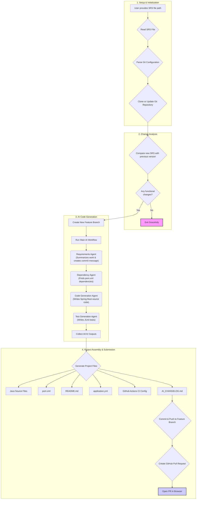

# AdkSdlcWorkflow_7.java: AI-Powered SDLC Automation

## 1. Overview

`AdkSdlcWorkflow_7.java` is a powerful, self-contained Java application that automates the entire Software Development Life Cycle (SDLC) for a Spring Boot microservice. It uses a sophisticated multi-agent system, leveraging Large Language Models (LLMs) via the Google ADK framework, to translate a high-level Software Requirements Specification (SRS) document into a fully functional, production-ready application.

The process starts with an SRS document and finishes by creating a new feature branch in a Git repository, committing the generated code, and opening a pull request on GitHub.

### Key Features:

-   **Automated Code Generation**: Creates a complete Spring Boot microservice, including controllers, services, repositories, and entities.
-   **Intelligent Change Analysis**: Compares the new SRS against a previously stored version to identify changes. If no functional changes are detected, the workflow exits gracefully, preventing redundant work.
-   **Dependency Management**: Automatically determines the necessary Maven dependencies from the requirements.
-   **Automated Testing**: Generates JUnit 5 test cases for the service and controller layers.
-   **Full Git Integration**: Clones a repository, creates a feature branch, commits the new code, and pushes it to the remote.
-   **Automatic Pull Request Creation**: Uses the GitHub CLI (`gh`) to create a pull request, streamlining the review process.
-   **Comprehensive Project Scaffolding**: Generates `pom.xml`, `application.yml`, a `README.md` with a project summary, and a GitHub Actions CI configuration file.

## 2. End-to-End Workflow

The following diagram illustrates the complete process from start to finish.



## 3. Core Concepts & AI Agents

The application's intelligence is distributed across several specialized AI agents.

-   **`ChangeAnalysisAgent`**: The first agent in the workflow. It compares the input SRS with the last version saved in the project's `.ai-state` directory. It produces a human-readable Markdown changelog. If there are no meaningful changes, it signals the application to stop.

-   **`RequirementsAgent`**: This agent analyzes the SRS to extract two key pieces of information:
    1.  A concise, one-line summary formatted as a conventional Git commit message (e.g., `feat: Implement user authentication API`).
    2.  A structured breakdown of the functional requirements (Feature, Input, Output, etc.).

-   **`DependencyAgent`**: It takes the structured requirements and identifies the necessary Maven dependencies (e.g., `spring-boot-starter-web`, `spring-boot-starter-data-jpa`).

-   **`CodeGenAgent`**: The core code generator. It uses the structured requirements to produce the Java source code for a complete Spring Boot microservice, including entities, repositories, services, and controllers.

-   **`TestGenAgent`**: This agent receives the generated Java code and writes corresponding JUnit 5 test cases to ensure the code is verifiable.

## 4. Prerequisites

To run this application, you must have the following installed and configured on your system:

1.  **Java JDK 17+**: The application is written using Java 17 features.
2.  **Maven**: Required for building the generated project.
3.  **Git CLI**: Used for all repository operations (cloning, branching, committing).
4.  **GitHub CLI (`gh`)**: Essential for authenticating with GitHub and creating pull requests automatically.
    -   You can install it from [cli.github.com](https://cli.github.com/).
    -   You must be authenticated. Run `gh auth login` to log in.

## 5. How to Use

### Step 1: Create the SRS Document

Create a text file (e.g., `srs.txt`) that contains the configuration for the repository and the project requirements. The file **must** contain the following keys:

-   `GitHub-URL`: The full URL to the GitHub repository to clone.
-   `checkout_branch`: The base branch to check out and compare against (e.g., `main`).
-   `Repository-Name`: The name of the directory where the repository will be cloned.

**Example `srs.txt`:**

```text
GitHub-URL: https://github.com/your-username/my-cool-project.git
checkout_branch: main
Repository-Name: my-cool-project

---

Feature: User Management API
Input: User details (name, email, password)
Output: A new user object with a unique ID
Constraints: Email must be unique. Password must be at least 8 characters long.
Logic: The service should hash the password before saving it to the database. The API should expose endpoints for creating, retrieving, updating, and deleting users.
```

### Step 2: Run the Application

1.  Execute the `main` method in `AdkSdlcWorkflow_7.java`.
2.  When prompted in the console, enter the full, absolute path to your `srs.txt` file.

The application will then execute the entire workflow, providing detailed logs in the console. If successful, it will print the URL to the newly created pull request and attempt to open it in your default web browser.

## 6. Project Structure & Key Methods

The generated project follows a standard Maven layout. The application logic is contained within the `AdkSdlcWorkflow_7` class.

-   `main(String[] args)`: The main entry point that orchestrates the entire workflow.
-   `readSrsData()`: Prompts the user for the SRS file path and parses the Git configuration and requirements.
-   `ensureRepositoryIsReady(...)`: Handles cloning the remote repository or pulling the latest changes if it already exists locally.
-   `performChangeAnalysis(...)`: Manages the logic for comparing the new SRS with the previous version stored in `.ai-state/srs.txt`.
-   `createFeatureBranchAndClean(...)`: Creates a timestamped feature branch and cleans the workspace of any old generated files to prevent stale code.
-   `buildWorkflow()`: Constructs the `SequentialAgent` that chains the `RequirementsAgent`, `DependencyAgent`, `CodeGenAgent`, and `TestGenAgent`.
-   `runMainWorkflow(...)`: Executes the main AI workflow and aggregates the results (commit message, dependencies, code, and tests).
-   `generateProjectFiles(...)`: Takes the output from the AI workflow and writes all the necessary project files (`pom.xml`, `README.md`, source code, etc.).
-   `commitAndPush(...)` & `createPullRequest(...)`: Manages the final Git operations and PR creation via the `gh` CLI.
-   `retryWithBackoff(...)`: A robust wrapper for making LLM API calls, with built-in retries and exponential backoff for handling transient server errors.

## 7. Output

Upon successful completion, the workflow produces:

1.  A new **local directory** containing the fully generated Spring Boot project.
2.  A **.zip archive** of the project in the root directory.
3.  A new **feature branch** pushed to the GitHub repository.
4.  A **pull request** on GitHub, ready for review.
5.  An **`AI_CHANGELOG.md`** file in the feature branch detailing the changes from the previous version.
6.  An **`.ai-state`** directory containing the `srs.txt` used for this run, which will serve as the "old" version for the next run. 