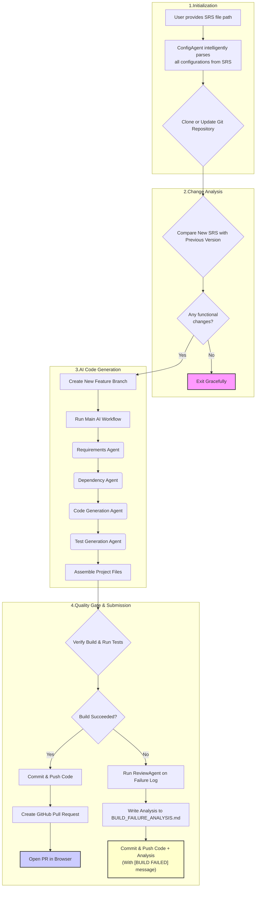

# AdkSdlcWorkflow_7: A Resilient, AI-Powered SDLC Automation System

**From Requirements to Pull Request: An Autonomous and Intelligent Workflow**

---

## The Challenge: Fragile Automation & Repetitive Work

Automating software development is powerful, but simple automation is often fragile. It breaks easily and requires human intervention. Furthermore, the manual development process is filled with repetitive, error-prone tasks.

**Key Problems:**
-   Writing boilerplate code for APIs.
-   Managing project dependencies and versions.
-   Writing unit tests.
-   Diagnosing build failures.

---

## The Solution: A Multi-Agent System with a Quality Gate

**`AdkSdlcWorkflow_7.java`** is an advanced multi-agent AI system that automates the entire software development lifecycle with a focus on resilience and intelligence.

It takes a **Software Requirements Specification (SRS)** and produces a **production-ready Spring Boot microservice** with a corresponding pull request on GitHub, intelligently handling build failures along the way.

---

## Why Google ADK & Gemini?

The choice of the Google Agents Development Kit (ADK) and the Gemini model was strategic for building this autonomous workflow.

### Benefits of Google ADK:
-   **Structured Agent Design**: ADK provides a robust framework for building multi-agent systems. It allows for the clear separation of concerns, with each agent having a distinct role and prompt.
-   **Simplified Orchestration**: The `SequentialAgent` makes it trivial to chain agents together, ensuring a predictable, linear workflow from requirements to code.
-   **State Management**: The framework handles the passing of context (like requirements and generated code) between agents, simplifying the data flow.
-   **Focus on Logic**: By abstracting away the boilerplate of calling the LLM, ADK allows developers to focus on the core logic: designing the agents and refining their prompts.

### Benefits of the Gemini Model:
-   **Strong Reasoning & Code Generation**: Gemini has powerful capabilities for understanding complex instructions and generating high-quality, syntactically correct code and configuration files.
-   **Large Context Window**: It can process large, multi-part prompts that include detailed instructions, examples, and the full context of previously generated code, which is essential for tasks like test generation.
-   **Speed and Efficiency**: The model is optimized for a balance of performance and quality, making it suitable for the rapid, iterative nature of this automated workflow.

---

## The Complete End-to-End Workflow



---

## Meet the AI "Team": A Collaborative Multi-Agent System

The workflow's intelligence is distributed across several specialized agents:

-   **`ConfigAgent`**: The project manager. Intelligently parses the SRS document for all project configurations (Git repo, branches, versions), understanding natural language variations to avoid rigid formatting requirements.
-   **`ChangeAnalysisAgent`**: The gatekeeper. Prevents redundant work by checking for meaningful changes in the requirements.
-   **`RequirementsAgent`**: The analyst. Extracts a structured summary and a Git commit message from the SRS.
-   **`DependencyAgent`**: The architect. Determines the required Maven dependencies based on the specified Java and Spring Boot versions.
-   **`CodeGenAgent`**: The developer. Writes the main Spring Boot application source code.
-   **`TestGenAgent`**: The QA engineer. Writes a comprehensive suite of JUnit 5 tests for the generated code.

---

## The "ReviewAgent": An AI for Automated Debugging

When a build fails, a specialized agent takes over.

**`ReviewAgent`**: The Debugger.
-   **Trigger**: A failed Maven build (`mvn clean verify`).
-   **Input**: The full, raw build log from the failed process.
-   **Task**: To analyze the complex error log, identify the single root cause of the failure, and provide a clear, human-readable explanation and suggested fix.
-   **Output**: A concise analysis that is saved for human review.

---

## The Quality Gate: Intelligent Failure Handling

The system is designed to be resilient and never leave the project in a broken state without context.

### The "Happy Path": Build Succeeded
1.  The generated code is committed and pushed.
2.  A pull request is automatically created on GitHub.
3.  The PR is opened in the browser, ready for human review.

### The "Failure Path": Build Failed
1.  The `ReviewAgent` analyzes the failure.
2.  Its diagnosis is written to a new file: `BUILD_FAILURE_ANALYSIS.md`.
3.  The broken code **and** the analysis file are committed and pushed to the feature branch.
4.  The commit message is automatically prefixed with `[BUILD FAILED]` for clarity.
5.  **Crucially, no pull request is created.**

This ensures that all work is preserved and that a human developer has all the context needed to understand what went wrong.

---

## How to Use It

### Prerequisites
-   Java 17+
-   Git CLI
-   GitHub CLI (`gh`) authenticated via `gh auth login`.

### The `srs.txt` File
Create a text file containing both non-functional and functional requirements.
```text
# --- Non-Functional Requirements ---
GitHub-URL: https://github.com/your-username/my-project.git
checkout_branch: main
Repository-Name: my-project
Java-Version: 17
SpringBoot-Version: 3.2.5

# --- Functional Requirements ---
Feature: User Management API
...
```

**Note:** The `ConfigAgent` is flexible! You can use variations like `java 21` or `Repo Name: my-project`. The agent will intelligently map them to the correct configuration.

### Run the Application
1.  Execute the `main` method in `AdkSdlcWorkflow_7.java`.
2.  Provide the absolute path to your `srs.txt` file when prompted.

---

## Conclusion: A Leap Forward in Autonomous Development

This workflow represents a significant step beyond simple code generation. By incorporating a **quality gate**, **automated debugging**, and **intelligent failure handling**, it becomes a truly resilient and trustworthy development partner.

**Key Benefits:**
-   **Speed**: Accelerates development from days to minutes.
-   **Consistency**: Enforces best practices and a uniform project structure.
-   **Resilience**: Never fails silently. It always provides a diagnosis.
-   **Traceability**: Preserves all attempts, successful or not, in the Git history for full transparency.

---

## Questions? 
