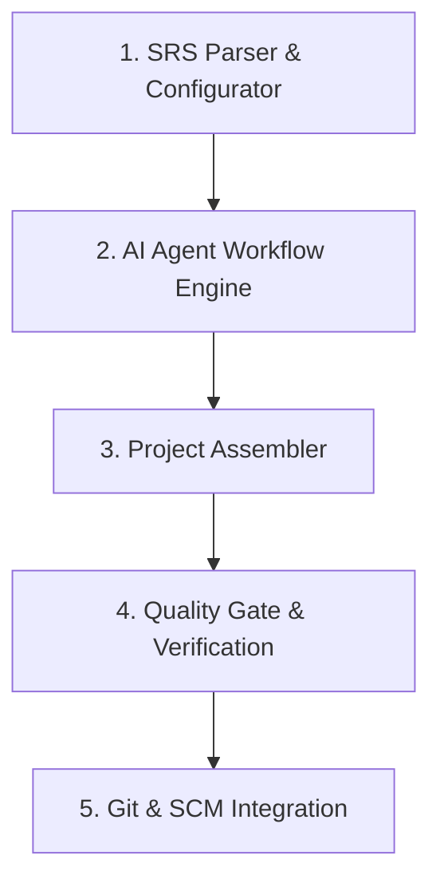
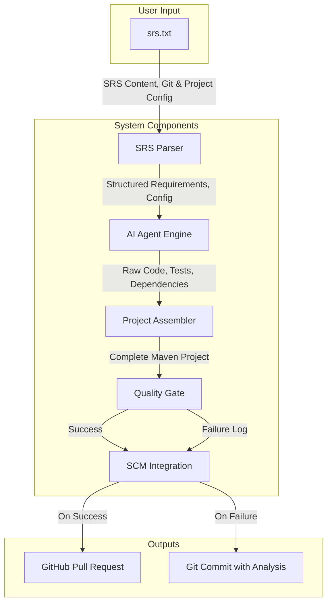
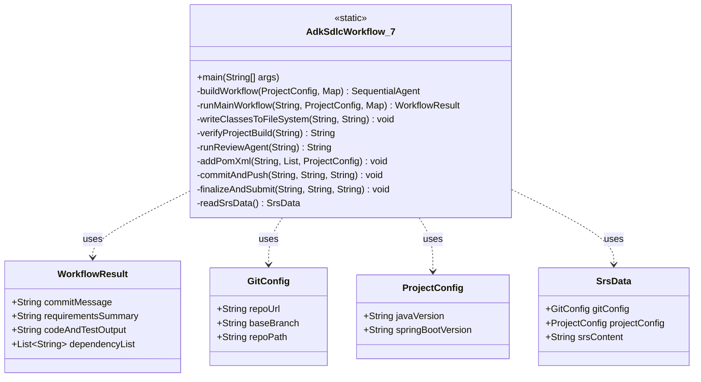

# ADK SDLC Workflow: High-Level & Low-Level Design Document

## 1. High-Level Design (HLD)

### 1.1. System Overview

The ADK SDLC Workflow is an autonomous, multi-agent AI system designed to automate the end-to-end software development lifecycle for a Spring Boot microservice. The system takes a high-level Software Requirements Specification (SRS) document as its primary input. It then processes this document through a pipeline of specialized AI agents to generate a complete, production-ready, and verifiable software project.

A key feature of the system is its resilience. It includes an integrated **Quality Gate** that automatically builds, tests, and analyzes the generated code. If this gate fails, a specialized **Review Agent** performs a root cause analysis of the failure, and the system commits the faulty code along with the analysis for human review, ensuring no work is lost and providing full traceability.

### 1.2. System Architecture & Core Components

The system is designed as a linear pipeline composed of five core components:

1.  **SRS Parser & Configurator**: This initial component is responsible for all user-facing interactions and setup. It reads the `srs.txt` file, parses both functional requirements and non-functional requirements (such as Git repository URL, Java version, and Spring Boot version), and prepares the environment for the workflow.

2.  **AI Agent Workflow Engine**: This is the core of the system, powered by the Google ADK framework. It orchestrates a `SequentialAgent` composed of several specialized sub-agents (`RequirementsAgent`, `DependencyAgent`, `CodeGenAgent`, `TestGenAgent`) that work in concert to transform the SRS into a collection of software artifacts (code, dependencies, commit messages).

3.  **Project Assembler**: This component takes the raw, unstructured output from the AI agents and assembles it into a valid Maven project structure. It is responsible for writing all the necessary files, including the `pom.xml`, `application.yml`, `README.md`, source code, and test files.

4.  **Quality Gate & Verification**: Before any code is committed, it must pass this critical step. The component runs a full Maven build (`mvn clean verify`), which compiles the code, runs all generated unit tests, and performs static analysis to check for bugs and vulnerabilities.

5.  **Git & SCM Integration**: This is the final component, responsible for all interactions with the source control management system. Based on the outcome of the Quality Gate, it follows one of two paths:
    -   **Success Path**: Commits the code, pushes it to a new feature branch, and creates a pull request on GitHub.
    -   **Failure Path**: Invokes the `ReviewAgent` for analysis, commits the broken code along with a `BUILD_FAILURE_ANALYSIS.md` file, and pushes the branch *without* creating a pull request.

### 1.3. Data Flow Diagram

The diagram below illustrates how data flows through the system from input to final output.

### 1.4. Technology Stack

-   **Core Language**: Java 17+
-   **AI Framework**: Google ADK (Agents Development Kit)
-   **Build & Dependency Management**: Apache Maven
-   **Source Control**: Git, GitHub CLI (`gh`)
-   **Logging**: SLF4J with Logback

---

## 2. Low-Level Design (LLD)

### 2.1. Class Diagram

The entire workflow is encapsulated within a single class, `AdkSdlcWorkflow_7`, which uses several private inner data classes to manage state.

### 2.2. Method Breakdown

-   `main(String[] args)`: The main entry point. Orchestrates the entire high-level workflow: reads SRS, prepares the Git repository, runs the AI workflow, triggers the quality gate, and executes either the success or failure path.
-   `readSrsData()`: Prompts the user for the SRS file path and parses all configuration keys (`GitHub-URL`, `Java-Version`, etc.) into the `GitConfig` and `ProjectConfig` data classes.
-   `buildWorkflow(...)`: Constructs the `SequentialAgent`. It initializes all the individual AI agents (`CodeGenAgent`, `TestGenAgent`, etc.) with their specific, detailed prompts.
-   `runMainWorkflow(...)`: Executes the `SequentialAgent` using the Google ADK `InMemoryRunner`. It aggregates all the raw text outputs from the agents into the `WorkflowResult` data class.
-   `writeClassesToFileSystem(...)`: The intelligent file parser. It uses a flexible regular expression to find `// File: ...` markers in the AI's output and extracts the associated code content, handling variations in formatting (like markdown code blocks).
-   `addPomXml(...)`: Dynamically generates the `pom.xml` file. It uses the `ProjectConfig` to set the correct Java and Spring Boot versions and includes logic to resiliently add required dependencies (like validation and OpenAPI) without creating duplicates.
-   `verifyProjectBuild(...)`: The quality gate. It executes `mvn clean verify` and captures the full output log. It returns `null` on success and the complete `buildLog` string on failure.
-   `runReviewAgent(...)`: Takes a `buildLog` string as input. It invokes a specialized `LlmAgent` to analyze the log and return a human-readable summary of the root cause.
-   `commitAndPush(...)` & `finalizeAndSubmit(...)`: These methods handle all Git and GitHub CLI interactions, encapsulating the logic for committing files, pushing branches, and creating pull requests.

### 2.3. AI Agent Prompts (Final Version)

The reliability of the system depends on highly refined prompts for the AI agents.

-   **`CodeGenAgent`**: Is instructed to use a specific base package (`com.generated.microservice`) and to include modern best practices like OpenAPI annotations and `jakarta.validation`.
-   **`DependencyAgent`**: Is given the Java and Spring Boot versions from the `ProjectConfig` and is explicitly told to find compatible dependency versions for third-party libraries.
-   **`TestGenAgent`**: Is given a detailed, multi-point set of instructions on how to write modern JUnit 5 tests, including how to mock dependencies and, critically, how to correctly test `void` methods.
-   **`ReviewAgent`**: Is framed as an "expert Java build engineer" and is tasked with finding the *primary root cause* of a failure and suggesting a fix, which results in a concise and useful diagnosis.

### 2.4. Error Handling Strategy

The system employs a multi-layered error handling strategy:
1.  **API Call Retries**: The `retryWithBackoff` method wraps all calls to the AI model. It automatically retries API calls up to 3 times with exponential backoff, making the system resilient to transient network or server errors.
2.  **Build Failure Path**: The primary workflow does not abort on a build failure. Instead, it triggers a controlled failure path that:
    -   Invokes the `ReviewAgent` for automated diagnosis.
    -   Creates a `BUILD_FAILURE_ANALYSIS.md` file with the results.
    -   Commits the broken code and the analysis file to the feature branch.
    This ensures that even a failed run produces a useful, reviewable artifact in the source control history. 
