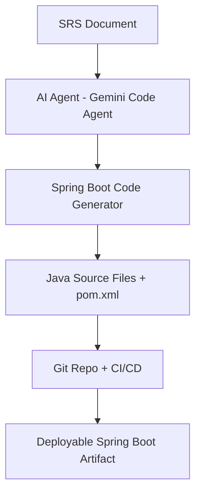

# Generated Spring Boot Microservice

This project was generated using a multi-agent AI system from an SRS document.

## 📦 Build

```bash
mvn clean install
```

## 🚀 Run

```bash
mvn spring-boot:run
```

## 🤖 CI/CD

This project uses GitHub Actions for Maven build automation.

## 🧠 High-Level Architecture

